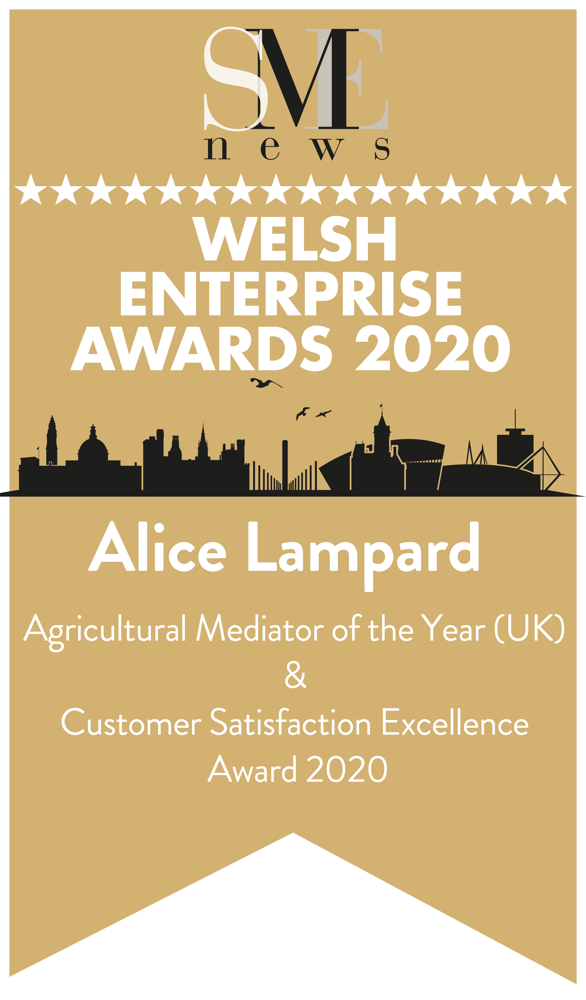

 

 

Alice is a CEDR accredited mediator with a pragmatic and effective style. She continues to hone her skills both in practice and as a member of CEDR Exchange, the Agricultural Law Association and the Civil Mediation Council. Autumn 2020 has seen her delivering presentations to both mediation and coaching conferences at an international level as her skill and capability gain recognition.
  

## History

 
With a farming background, Alice combined being a mother of 4 and an active role in the family construction firm with hands on experience of site work including steel and concrete. Forming a renowned herd of pedigree cattle between 2007 and 2014, she has written articles for beef breed journals on breeding values and health screening
  
In 2016 Alice embarked upon developing her coaching skills and has gained an
Advanced Accredited Diploma in coaching from the Centre for Coaching, studying at the British Psychological Institute in London. In 2017 Alice gained mediation accreditation with CEDR studying in Barcelona. Alice regularly attends both national and international coaching and mediation conferences maintaining a fresh outlook.
  
With a private practice coaching across sectors, Alice has enjoyed being a guest lecturer in coaching for Masters level modules. Wholly focused on the benefit she brings to the individual(s) present before her, she adapts her style and delivery drawing on a depth of knowledge and practical experience.
  
Alice enjoys her roles as both a mediator and coach, bringing a positive energy to any situation and enabling clients to work through their challenges as they identify and achieve their goals.
 

## Training, Qualifications & Awards

#### <b> CEDR </b>
##### CEDR Workplace mediation
<h6> 2021 </h6>

 

#### <b> Centre for Coaching and British Psychcological Society </b>
##### Primary Certificate in Coaching Supervision
<h6> 2021 </h6>

 

#### <b> Welsh Enterprise Awards 2020 </b>
##### Customer Satisfaction Excellence & Agricultural Mediator of the Year (UK)

{width=25%}

 

#### <b> CEDR </b>
##### CEDR Accredited Mediator
<h6> 2017 </h6>

 

#### <b> Centre for Coaching </b>
##### Coach Training, CB, ACT, Solution, Problem and Performance Development Coaching, Advanced Accredited Diploma
<h6> 2016 – 2018 
  
Recognised by the International Society for Coaching Psychology and approved by the British Psychological Society Learning Centre, ILM, IMS & Association of Coaching </h6>

 

#### <b> Centre for Coaching, Accredited by Mdx Uni, ILM and approved by the British Psych’ Soc </b>
##### Certificate, Psychology of Coaching, Stress Management , Performance and Problem focused counselling and training
<h6> 2016 – 2017 </h6>

 

#### <b> Swansea University </b>
##### ILM Level 5, Management and leadership
<h6> 2014 – 2015 </h6>

