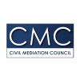

 

 

### Accredited Mediator and Change/Performance Coach

 

"Providing effective mediation to enable disputing parties to achieve outcomes they don't regret."

 
 
A CEDR accredited mediator combining a wealth of coaching experience to deliver a pragmatic and effective style of delivery. Sharing her experience at an international level with the International Society for Coaching Psychology ISCP congress in September 2020 and the CAAEB panel on mediation within the ENAEX Trade Conference in Brazil in November 2020. See recent activity <b>[here](#news)</b>

 
 
 

