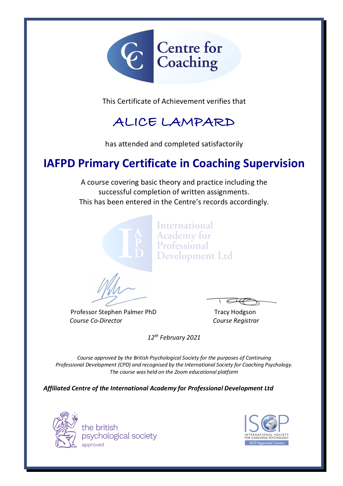
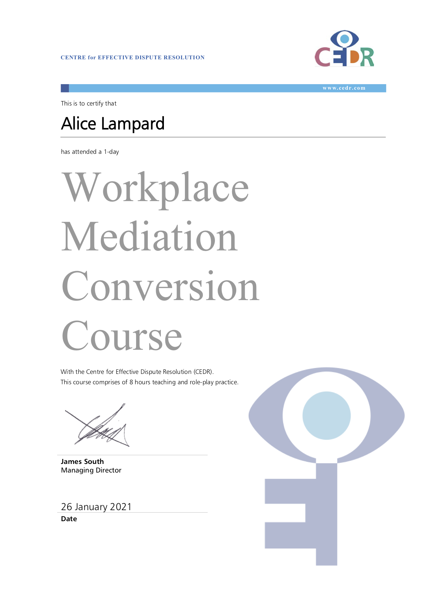
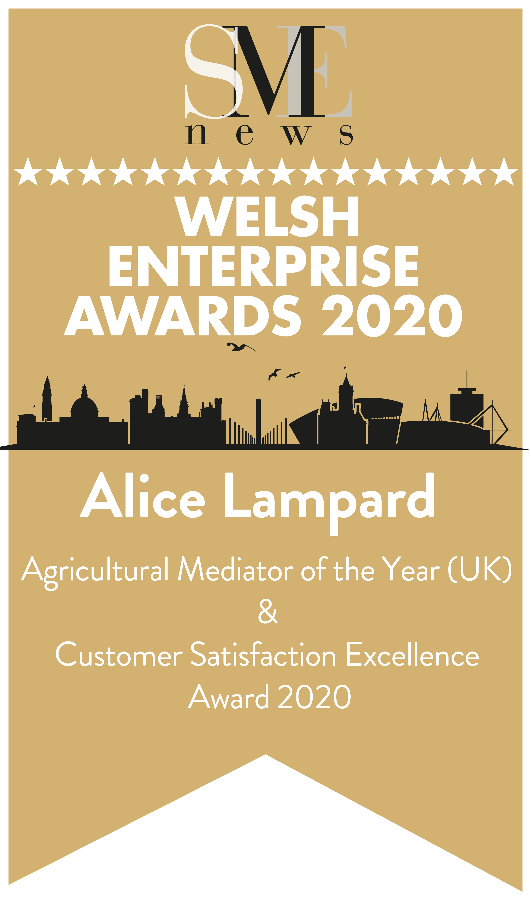

 

## Latest News

 

#### <b> October 2021 </b>
##### Alice revisited the EANEX Trade Conference in Brazil as a panel member discussing Mediation as a resource for agribusiness trade between Brazil and UK. 

##### A repeat of last year, Alice was awarded SME Welsh Enterprise Awards Agricultural Mediator of the Year 2021

{width=25%}

 

#### <b> 15th February 2021 </b>
##### Arrival of a certificate for the written element of the Supervision Course taken back in October 2020 issued by the Centre for Coaching and British Psychcological Society approved. 

{width=25%}

 

#### <b> 26th January 2021 </b>
##### Alice attended a CEDR Workplace mediation conversion course to add to her existing civil and commercial mediation accreditation.

{width=25%}

 

#### <b> 16th January 2021 </b>

##### Alice delivered a lecture on mediation followed by Q&A to the lawyers at [Getulio Vargas Foundation] (https://www.topuniversities.com/universities/fundacao-getulio-vargas-fgv)  Sao Paulo, Brazil.  Her second 'visit' to Brazil to share her experience in Mediation, she is looking forward to being able to make the journey in person rather than via Zoom. 

 

#### <b> December 2020 </b>
##### Alice joined the Civil Mediation Council.

 

#### <b> 13th November 2020 </b>
##### <b>ENAEX International Trade Conference Brazil – CAAEB Panel on Mediation in Agribusinesses UK and Brazil</b>. Lead speaker and joined on the panel by Luiz Roberto Barcellos; President of the Brazilian Fresh Fruit Growers and Exporters Association – ABRAFRUTAS and Ary Rogerio Moura; Commercial Manager for Sipal, Brazil

 

#### <b> 13-14th October 2020 </b>
##### Alice attended a course with the Centre for Coaching a Certificate in Coaching Supervision. Written element submitted, fingers crossed, we can expect to hear in February 2021. A great way to develop both coaching and supervision skills and gain insight and practical experience to deliver professional supervision to developing coaches with much to take across into mediation.

 

#### <b> October 2020 </b>
##### Nominated and awarded for customer satisfaction in mediation.

{width=25%}

 

#### <b> 6-9th September 2020 </b>
##### 10th International Congress of ISCP across the three days of events. Alice was delighted to deliver a poster for a paper co-written with Dr Siobhain O’Riordan CPsychol FISCP with the snappy title “Positive psychology and coaching within the Welsh livestock farming sector: exploring the relationship with profitability and productivity when set against the sustainable future of farm businesses and the environment”.

 