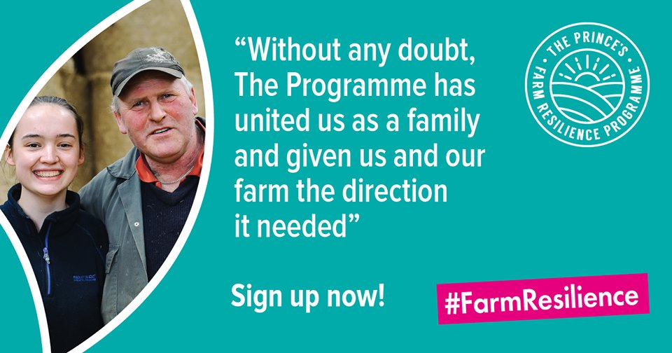

 

## Latest News

 

#### <b> 13th September 2019 </b>
##### Family farm businesses from around St Clears are invited to register for the fourth year of The Prince’s Farm Resilience Programme starting this October. The highly successful programme gives FREE business skills training and is aimed at farms (tenant or owner occupied) with a main enterprise of dairy, beef or sheep.

 
 

#### <b> 28th August 2019 </b>

##### Welsh farmers last registered for waste exemptions in 2016. It's time to do it again so here is the [link](https://naturalresources.wales/splash?orig=%2fpermits-and-permissions%2fwaste-permitting%2fregister-or-renew-your-waste-exemptions-agricultural-premises%2f&lang=cy) to make it easy for you 