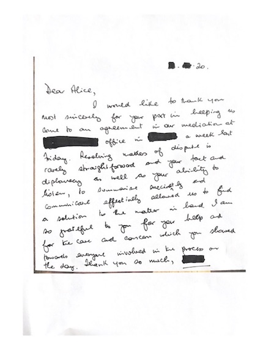

 

### <b>Mediation</b>

#### <b> Nerys Llewellyn Jones </b>
##### Managing partner at Agri Advisor
<h6> Alice is an effective mediator who puts in maximum effort to assist parties achieve a mediated settlement of their own design. She understands the practicalities and the importance of getting a workable solution for all concerned for the longer term. I never hesitate in putting her forward as a mediator for my client's dispute nor in recommending her to others. </h6>

 

#### <b> David Lewis </b>
##### Estate Trustee at Heane Castle Estate
<h6> Alice assisted us with a workplace mediation session. There was a degree of skepticism amongst the participants beforehand, but upon arrival Alice put everyone at ease and clearly explained the process, and invited the participants to explain what they would like to get out of the session. Several key goals were achieved, and targets set, with full buy-in from those involved.
Post session feedback from those everyone involved was excellent, I would highly recommend Alice for this type of work, and will have no hesitation in using her services again, if the need arises. </h6>

 

#### <b> Legal representative for claimant </b>
<h6> Alice worked effectively and swiftly within the short time period available for the mediation and ensured that all parties were focused on reaching a settlement. </h6>

 

#### <b> Farm Mediation </b>

<h6> Dear Alice,
 
I would like to thank you most sincerely for your part in helping us come to an agreement in our mediation at XXXX. Resolving matters of dispute is rarely straightforward and your tact and diplomacy as well as your ability to listen, to summarise succinctly and communicate effectively allowed us to find a solution to the matter in hand. I am so grateful to you for your help and for the care and concern which you showed towards everyone involved in the process on the day.
 
Thank you so much </h6>

### <b> Facilitation </b>

#### <b> Sara Jenkins </b>
##### Farmer/Milk vendor, Farming Connect Agrisgop Leader
<h6>Having known Alice for many years and recognising her skills in facilitation, Alice was recently invited to facilitate a Farming Connect meeting. Prior to the meeting, Alice met with the working group to form a structure and helped to devise relevant topics for discussions during breakout sessions. The meeting attracted over 45 attendees from diverse backgrounds, and most were unfamiliar with each other; a small number attend online only. Alice managed to include the opinions of delegates attending virtually, as well as those who were present in person, quite a task! Alice’s exploratory style was instrumental in enabling us to end the meeting with a clear set of objectives and measurable actions, all within the timeframe set for the meeting. Alice’s skill in keeping discussions on track and moving forward has created momentum for a newly formed group to work towards achieving the objectives set during the meeting.</h6>
 

#### <b> Hugh Williams </b>
##### Associate Director John Clegg & Co
<h6> I attended the ConFor event at the RWAS 2022 regarding woodland creation that Alice facilitated. I was encouraged by the conversation regarding planting in Wales. Listening, active pre-consultation, careful use of language, calmly seeking and valuing others views, and conflict resolution are all required and these can all be used to help the need/momentum/understanding for woodland creation. Alice was an excellent facilitator, getting the panel to self introduce, the audience to highlight their interests and teasing out questions and answers. Alice helpfully extended the discussion time and summarised the offered/suggested introductions received from the panel. Having an interested, knowledgeable and impartial facilitator - and panel - was excellent at giving balance, direction and insight. Thank you. </h6>

 

#### <b> Anthony Geddes </b>
##### Wales Confor
<h6>I have been fortunate to have Alice support a recent event based on understanding and engaging with communities. These challenging conversations about stakeholder engagement and social responsibilities could easily have been handled poorly. I found Alice's approach to the event and her preparation before hand excellent. She is not afraid to ask direct and engaging questions but without being aggressive or threatening. This ability to cut through the noise and focus on the core topics of the dispute or concern really opens up the conversation and as a result, helps establish meaningful relationships.
 
I look forward to working with her in future and have no hesitation in
recommending her as a mediator and facilitator. </h6>

 

### <b>Coaching</b>

#### <b>Rob Watson </b>
##### Crop Manager at G's Fresh
<h6>Alice and I were put in touch via the Tesco Future Farmer programme, where Alice was a mentor for me. In the course of just under a year, she really offered me some fantastic advice and new ways of thinking and approaching situations within my professional and personal life. It was a pleasure to have the knowledge and different perspective from someone who from the start took a genuine interest in me and my career and what I wanted to achieve, and helped me get there!

Thanks again Alice for your help and support! </h6>

 

#### <b> Robert South MICFor MArborA </b>
<h6>I can highly recommend Alice for coaching to achieve your goals, but you have to engage and not only listen but hear. Alice has a wonderful way of getting you to solve your own issues, if you realise it or not, not only that a great personality and very approachable and professional.
</h6>

 

#### <b> Anthony Geddes </b>
##### Wales Confor
<h6>I have had the pleasure of attending events where Alice has been a contributor or a chair and have always been impressed with her ability to draw people into the discussion whilst keeping them focused on achieving outcomes. Her capable and direct approach to dealing with people and the topics of discussion or disagreement is refreshing and an invaluable skill.
  
When I approached Alice to coach me, I once again found her professional and insightful. Her ability to listen, assess a situation and talk clearly and directly on a one to one basis produces good results. This coupled to a wealth of experience in farming, family and working life really gives her a edge in understanding each potential driver in a situation.
  
It is a pleasure to recommend Alice and I look forward to continuing to work with her. </h6>

 

#### <b> Murray Pullin </b>
<h6> In business, and personal life, it is easy to get bogged down one problem that can impact how you manage other events in business or your life. Alice gave me some coaching to help me gain perspective on some challenges that I faced. Alice's knowledge and techniques delivered positive results for me that I can use again and again. For that, I would strongly recommend Alice and her coaching. </h6>

 

#### <b> Catherine Orton </b>
##### BW
<h6> Alice is a highly motivated individual, with both strategic and practical out of the box powers of assessment, analysis and decision making, coupled with insightful people skills. Her life and career experience has produced a broad and deep knowledge of Food, Agriculture and associated sectors, and now delivers an innovative and quality experience to her Rural Business clients. I have witnessed Alice's relaxed confidence and driven attitudinal approach thrive in the Agrisgôp environment where she has been able to capitalize on extensive subject knowledge and contact network. An inspiring and engaging professional! </h6>

 

#### <b> Alison Harvey </b>
<h6> I have had the good fortune of working with Alice as part of the women in agriculture group in Lampeter. Through this group she has driven us to think and to have purpose, this in turn has given us confidence and we continue to meet as a group and to learn. </h6>

 

#### <b> Wendy Jenkins </b>
##### Cymru Agricultural & Rural AdviceLtd
<h6>The Lampeter Women in Agriculture group has developed into a group that has benefited all us a great deal, in terms of building confidence and getting our views heard. This would not have happened without Alice’s skills as the group facilitator. She organised, encouraged, and more importantly challenged all of us to participate actively within the group. </h6>

 

